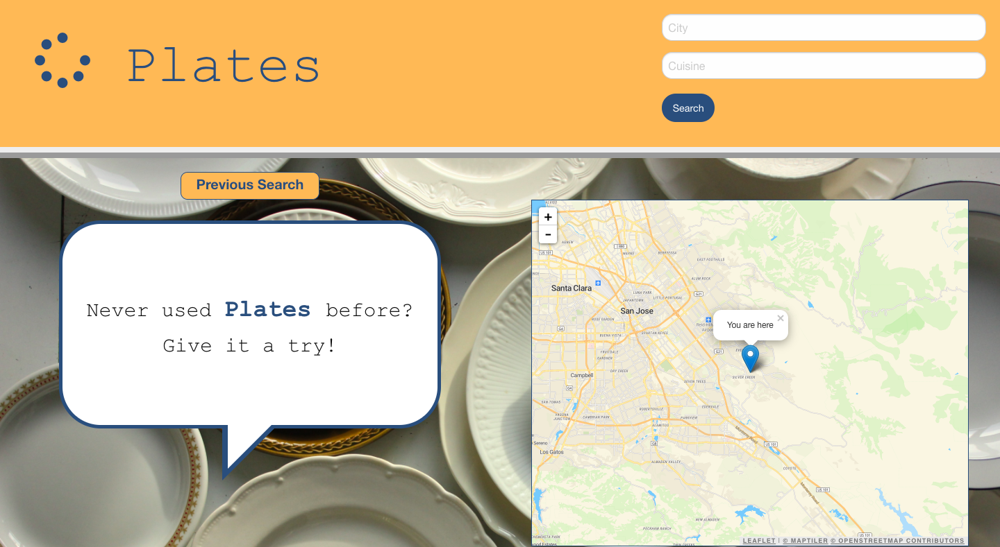
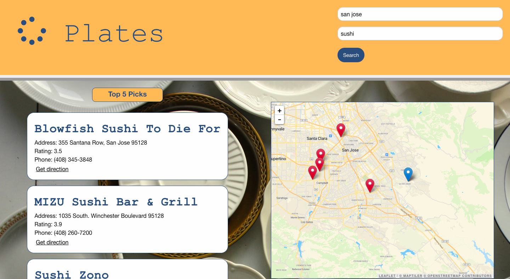
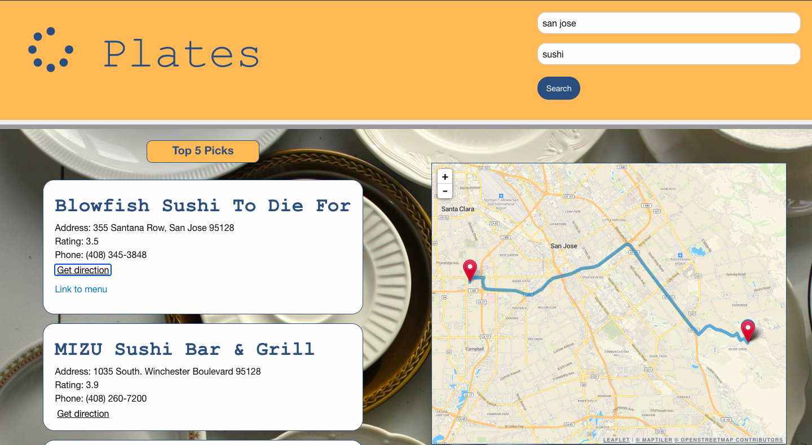

# Plates.
Group 10: Rachel Kroetch, Uyen Nguyen, Tria Thao

## Project Description
An app that allows the user to search for restaurants when they want to try some place new.  The app uses the APIs of Zomato and OpenStreetMap, along with Leaflet and MapQuest to provide information about the restaurants as well as directions to the place of their choice. App utilizes HTML, CSS, JavaScript, jQuery, and Foundation.

## User Story
AS A food enthusiast
I WANT to find local restaurants based on ratings and cuisine type
SO THAT I can try new food in my area

## Acceptance Criteria
- when user opens the app, 
- then it shows the last search or tells the user to try the app
- when user searches city and cuisine type, 
- then given top 5 results and map locations
- when given the top 5 results,
- then the user will see the address, rating, and phone number of each
- when user clicks a restaurant, 
- then given link to menu
- when user clicks "Get direction", 
- then given directions to the restaurant
- when user refreshes page,
- then the previous search results stay

## API's
Zomato, OpenStreetMap, & MapQuest

## Deployed Site Link
https://rekroetch.github.io/plates/

## Images

